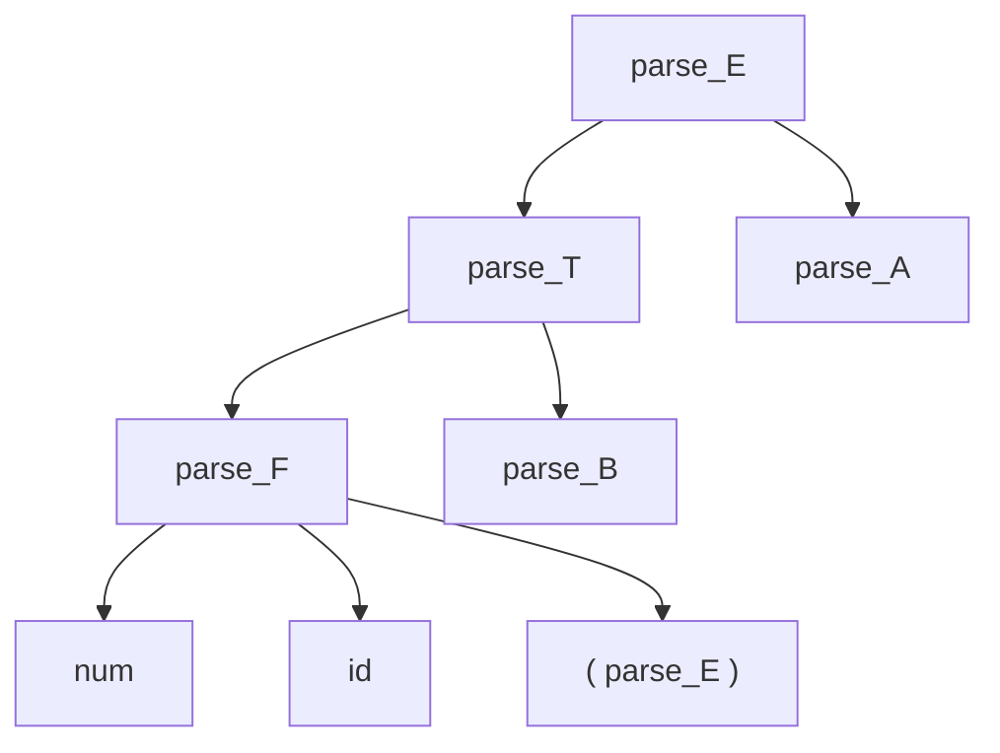

# Formal-Languages-and-Compilers
# Лабораторная работа: Специализированный текстовый редактор с поддержкой локализации

## 1. Название и цель лабораторной работы

**Название:** Разработка пользовательского интерфейса (GUI) для языкового процессора

**Цель:** Создание кроссплатформенного графического интерфейса (GUI) для языкового процессора в виде специализированного текстового редактора.

**Постановка задачи:** Разработать оконное приложение – текстовый редактор, который в дальнейшем будет расширен до полноценного языкового процессора для анализа исходного кода.

## 2. Сведения об авторе

- **ФИО:** Дудовцев И.И.
- **Группа:** АВТ-314
- **Год:** 2026

## 3. Описание проекта

Реализован кроссплатформенный текстовый редактор на Python + PyQt6 с поддержкой двух языков интерфейса (русский и английский).  
Приложение соответствует требованиям задания:

- Интерфейс содержит 4 основных области: главное меню программы, панель инструментов, редактор текста, область вывода результатов (только чтение)
- Возможность изменения размеров областей
- Полноценные меню «Файл», «Правка», «Выполнить», «Язык», «Справка»
- Поддержка стандартных операций редактирования
- Подтверждение сохранения изменений при выходе или создании нового файла
- Кнопка «Пуск» для запуска анализа
- Динамическая смена языка интерфейса без перезапуска
- Тулбар с иконками

Главное окно программы, верхняя часть которой - рабочая область, нижняя часть - вывод результатов (только для чтения)


В главном окне расположен тулбар, в котором слева направо располагаются:
1. Пуск (Запускает анализатор)
2. Новый (Создает новый файл)
3. Открыть (Открывает файл)
4. Сохранить (Сохраняет текущий файл)
5. Отменить (Отменяет последнее действие)
6. Вернуть (Возвращает последнее действие)
7. Вырезать (Вырезает выделенный фрагмент текста)
8. Копировать (Копирует выделенный фрагмент текста)
9. Вставить (Вставляет текст)
10. Справка (Показывает возможности программы)
11. О программе

В данной части расположено меню. 


Пункт "Файл" содержит следующие элементы:


Пункт "Правка" содержит следующие элементы:


Пункт "Пуск" содержит следующий элемент:


Пункт "Язык" содержит следующие элементы:


Пункт "Справка" содержит следующие элементы:


## 4. Используемые технологии

- **Язык программирования:** Python 3.11
- **Фреймворк GUI:** PyQt6
- **Локализация:** JSON-словарь + функция retranslate_ui
- **Среда разработки:** VS Code
- **Сборка в исполняемый файл:** PyInstaller

## 5. Инструкция по сборке и запуску

### 5.1. Запуск из исходного кода (требуется Python)

1. Убедитесь, что на компьютере установлен **Python 3.11 или выше**  
2. Создайте и активируйте виртуальное окружение:

   ```bash
   python -m venv venv
   ```
3. Установите все зависимости:
   ```bash
   pip install -r requirements.txt
   ```
4. Запустите исполняемый файл:
   ```bash
   python editor_window.py
   ```
   
### 5.2. Готовый исполняемый файл (Python не требуется)
Для этого необходимо перейти в папку dist, найти файл TextEditor.exe и запустить его.

Данный метод не требует установки Python и зависимостей

### 5.2. Сборка исполняемого файла

1. Установите PyInstaller (в активированном виртуальном окружении):
```bash
   pip install pyinstaller
   ```
2. Выполните команду сборки из корня проекта:
```bash
pyinstaller --onefile --windowed --add-data "icons;icons" --add-data "translations;translations" --name "TextEditor" editor_window.py
```
3. После завершеня установки найдите исполняемый файл, путь к нему:
```bash
dist\TextEditor.exe
```

---

# Лабораторная работа 2: Разработка лексического анализатора (сканера)
## Цель лабораторной работы
**Цель:** Изучить назначение и принципы работы лексического анализатора в структуре компилятора. Спроектировать алгоритм (диаграмму состояний) и выполнить программную реализацию сканера для выделения лексем из входного текста. Интегрировать разработанный модуль в ранее созданный графический интерфейс языкового процессора.

**Постановка задачи:** Разработать лексический анализатор (сканер) в соответствии с индивидуальным вариантом задания, интегрировать его в приложение из лабораторной работы №1 и обеспечить наглядный вывод результатов.
### 1. Вариант задания:
Номер вариант - 98. Цикл repeat-while на языке Swift. 
Перечень допустимых лексем в рамках варианта задания:
| repeat | Ключевое слово |
|--------|----------------|
| {      | Начало блока   |
| number | Идентификатор  |
| +/-/*= | Составной оператор присваивания |
| 2      | Целое число    |
| }      | Конец блока    |
| while  | Ключевое слово |
| <=     | Оператор сравнения |
| 10     | Целое число    |
| ;      | Конец оператора |

Примеры корректного ввода
```bash
repeat {
    number += 1
} while number < 5;
```
```bash
repeat {
    counter -= 1
} while counter > 0;
```
```bash
repeat {
    number *= 3
} while number < 50;
```

### 2. Диаграмма состояний


### 3. Тестовые примеры
Пример с корректной строкой:

Пример с ошибкой:


---

# Лабораторная работа 3. Разработка синтаксического анализатора (парсера)
## Цель лабораторной работы
**Цель:** Изучить назначение и принципы работы синтаксического анализатора в структуре компилятора. Спроектировать грамматику, построить соответствующую схему метода анализа грамматики и выполнить программную реализацию парсера с нейтрализацией синтаксических ошибок методом Айронса. Интегрировать разработанный модуль в ранее созданный графический интерфейс языкового процессора.
**Постановка задачи:** Разработать синтаксический анализатор (парсер) в соответствии с индивидуальным вариантом курсовой (расчетно-графической) работы, интегрировать его в приложение из лабораторной работы №1 и обеспечить наглядный вывод результатов анализа.
### 1. Вариант задания:
Номер вариант - 98. Цикл repeat-while на языке Swift. 
Перечень допустимых лексем в рамках варианта задания:
| repeat | Ключевое слово |
|--------|----------------|
| {      | Начало блока   |
| number | Идентификатор  |
| +/-/*= | Составной оператор присваивания |
| 2      | Целое число    |
| }      | Конец блока    |
| while  | Ключевое слово |
| <=     | Оператор сравнения |
| 10     | Целое число    |
| ;      | Конец оператора |

Примеры корректного ввода
```bash
repeat {
    number += 1
} while number < 5;
```
```bash
repeat {
    counter -= 1
} while counter > 0;
```
```bash
repeat {
    number *= 3
} while number < 50;
```

### 2. Разработка грамматики (полное определение разработанной грамматики):


### 3. Классификация грамматики (по Хомскому):
Синтаксис языка соответствует контекстно-свободной грамматике.


### 4. Метод анализа (рекурсивный спуск):
В проекте был реализован рекурсивный спуск в качестве алгоритма синтаксического анализа.


### 5.Диагностика и нейтрализация синтаксических ошибок.
## Диагностика синтаксических ошибок

Парсер собирает ошибки в виде структуры:
`ParseError(fragment, line, start_pos, end_pos, message)`
При вызове `analyze_syntax(tokens)` объединяются:
- лексические ошибки из `collect_lexer_errors`
- синтаксические ошибки из `Parser.parse()`


## Формирование сообщений
- `err_here(msg)`  
  Ставит ошибку в текущем токене или (если достигнут EOF) в конце предыдущего.
- `add_err(msg, frag, line, s, e)`  
  Создаёт ошибку с заданным фрагментом и позицией.


## Нейтрализация ошибок
Парсер использует два механизма восстановления:
### `sync_to(*codes)`
- Пропускает токены до первого совпадения с `codes`
- Используется после ошибки, чтобы продолжить разбор
### `syncstmt()`
- Пропускает токены до `;` или `}`
- Эффективен для восстановления после ошибок в операторе


## Восстановление происходит в:

### `expect(code, msg, *sync)`
- Если ожидаемый токен отсутствует:
  - добавляется сообщение об ошибке
  - вызывается `sync_to(...)`
  - повторно пытается прочитать токен


### `stmt()`
- Если отсутствует идентификатор перед `=` / `+=`:
  - добавляется ошибка
- Если отсутствует оператор присваивания:
  - добавляется ошибка
  - выполняется синхронизация по `;`


### `expr_after_assign()`
- Если после `=` / `+=` нет `IDENTIFIER` или `DIGIT`:
  - создаётся точное сообщение об ошибке
  - выполняется синхронизация по:
    - `;`
    - арифметическим операторам
    - `}`
    - `while`


### `term()`
- Если не найден `IDENTIFIER` или `DIGIT`:
  - добавляется ошибка: ожидалось выражение
  - выполняется `sync_to` по:
    - `;`
    - арифметическим операторам
    - `}`
    - `while`

### 6.Тестовые примеры
Без ошибок


---

С 1 ошибкой:


---

С 5 ошибками:


---

# Лабораторная работа 4. Реализация алгоритма поиска подстрок с помощью регулярных выражений
## Цель лабораторной работы
**Цель:** Изучить теоретические основы регулярных выражений и их применение для поиска и извлечения подстрок из текста. Освоить практические навыки использования библиотечных средств работы с регулярными выражениями, а также интеграцию алгоритмов поиска в графический интерфейс приложения.
**Постановка задачи:** Разработать модуль поиска подстрок с использованием регулярных выражений, интегрировать его в существующее приложение (текстовый редактор) и обеспечить наглядный вывод результатов.
### 1. Вариант задания:

I Блок. 
   1. Построить РВ, описывающее китайские почтовые индексы.

II Блок.
   10. Построить РВ, описывающее номера карт, принадлежащих платежной системе UnionPay.

III Блок. 
   27. Построить РВ для поиска HSL-кода цвета.

### 2. Решение задач:
---

## I Блок

### 1. Китайские почтовые индексы

**Описание:**  
Почтовый индекс Китая состоит ровно из 6 цифр.

**Регулярное выражение:**
```bash
^\d{6}$
```

**Пояснение:**
- `^` — начало строки  
- `\d` — цифра (0–9)  
- `{6}` — ровно 6 цифр  
- `$` — конец строки  

**Подходят:**
- 100000  
- 310001  
- 518000  

**Не подходят:**
- 12345  
- 1234567  
- 12A456  

**Тестовые примеры:**


---

## II Блок

### 10. Номера карт UnionPay

**Описание:**  
Номер карты UnionPay начинается с `62` или `81` и содержит от 16 до 19 цифр.

**Регулярное выражение:**
```bash
^(62|81)\d{14,17}$
```

**Пояснение:**
- `^` — начало строки  
- `(62|81)` — начинается с 62 или 81  
- `\d` — цифра  
- `{14,17}` — от 14 до 17 цифр  
- `$` — конец строки  

**Подходят:**
- 6212345678901234  
- 8112345678901234567  
- 621234567890123456  

**Не подходят:**
- 6012345678901234  
- 621234567890123  
- 62123456789012345678  

**Тестовые примеры:**


---

## III Блок

### 27. HSL-код цвета

**Описание:**  
Формат: `hsl(hue, saturation%, lightness%)`  
- hue: 0–360  
- saturation: 0–100%  
- lightness: 0–100%  

**Регулярное выражение:**
```bash
^hsl\(\s*(360|3[0-5]\d|[12]?\d{1,2})\s*,\s*(100|[1-9]?\d)%\s*,\s*(100|[1-9]?\d)%\s*\)$
```

**Пояснение:**
- `^hsl\(` — начало строки и `hsl(`  
- `\s*` — пробелы (необязательные)  
- `(360|3[0-5]\d|[12]?\d{1,2})` — hue (0–360)  
- `(100|[1-9]?\d)%` — проценты (0–100)  
- `,` — разделители  
- `\)` — закрывающая скобка  
- `$` — конец строки  

**Подходят:**
- hsl(120, 50%, 40%)  
- hsl(0,0%,0%)  
- hsl(360, 100%, 100%)  
- hsl( 240 , 75% , 60% )  

**Не подходят:**
- hsl(400, 50%, 50%)  
- hsl(120, 150%, 50%)  
- rgb(120, 50%, 40%)  
- hsl120,50%,40%  

**Тестовые примеры:**


---

## Дополнительное задание - граф автомата


---
# Лабораторная работа 5. Семантический анализ и представление AST

## Цель лабораторной работы

**Цель:** Изучить назначение и принципы работы семантического анализатора в структуре компилятора. Освоить методы построения абстрактного синтаксического дерева (AST) и проверки контекстно-зависимых условий (семантических правил) для заданной синтаксической конструкции.

**Постановка задачи:** Развить ранее созданный синтаксический анализатор (парсер) до семантического: построить абстрактное синтаксическое дерево (AST) и реализовать проверку контекстно-зависимых условий в соответствии с индивидуальным вариантом курсовой работы.

---

## 1. Вариант задания: тема работы и примеры верных строк

**Тема (вариант 98):** цикл **repeat–while** на языке Swift: 

**Примеры верных строк:**

```bash
repeat {
    x = 1;
    x += 1;
} while x < 10;
```

```bash
number = 1;

repeat {
    number += 1;
} while number < 5;
```

```bash
repeat {
    counter -= 1;
} while counter > 0;
```

---

## 2. Контекстно-зависимые условия

В модуле `semantic_analysis.py` класс `SemanticAnalyzer` обходит AST и накапливает сообщения в `SemanticError` (поля: текст, строка, позиции, фрагмент).

| Проверка | Суть | Пример фрагмента | Ожидаемое сообщение |
|----------|------|-------------------------|----------------------------------------|
| Уникальность имён при объявлении | Повторное объявление через `=` для уже объявленного идентификатора | дважды `a = 1;` в одной области | `Идентификатор "…" уже объявлен ранее (строка N)` |
| Использование до объявления в выражении | В правой части `=` / `+=` и т.д. идентификатор не объявлен ранее в этой же области | `x = y;` при отсутствии объявления `y` | `Идентификатор "…" использован до объявления` |
| Составное присваивание без объявления | Для `+=`, `-=`, … идентификатор должен быть предварительно объявлен через `=` | `x += 1;` без предшествующего `x = …` | `Идентификатор "…" не объявлен ` |
| Допустимые значения литералов | Целые литералы в диапазоне **Int32** | `x = 2147483648;` | `Значение литерала … вне допустимого диапазона Int32 [-2147483648; 2147483647]` |
| Идентификаторы в условии | В условии `while` все идентификаторы должны быть объявлены в объединённой области | `while y < 1;` при объявлении только `x` | `Идентификатор "…" в условии использован до объявления` |
| Совместимость типов | Модель одна - **Int**; при некорректном узле выражения возможно сообщение о правой части | (краевые случаи разбора) | `Ожидался тип Int для правой части` |

---

## 3. Структура AST: типы узлов

Корень при полном разборе конструкции - **`ProgramNode`**. Узлы описаны в `semantic_analysis.py`.

| Тип узла | Назначение | Основные поля |
|----------|------------|----------------|
| `ProgramNode` | Вся программа | `declarations` - список операторов, объявленных ранее ; `repeat_while` - узел цикла |
| `RepeatWhileNode` | Конструкция `repeat … while …` | `body` - список операторов тела; `condition` - корень логического/сравнивающего выражения или `None` |
| `AssignStmtNode` | Присваивание в теле или ранее | `name`, `name_token`, `operator` (`=`, `+=`, … или `None`), `value_type` (узел типа), `value` (поддерево выражения) |
| `IntNode` | Тип **Int** в схеме присваивания | без полей данных |
| `IntLiteralNode` | Целый литерал | `value`, `token` |
| `IdentifierNode` | Использование идентификатора | `name`, `token` |
| `BinaryOpNode` | Арифметика | `operator`, `left`, `right` |
| `ComparisonNode` | Сравнение | `left` (идентификатор), `operator`, `right` |
| `LogicalAndNode` / `LogicalOrNode` | `and` / `or` | `left`, `right` |
| `NotNode` | Логическое отрицание | `child` |


---

## 4. Рисунок AST для верной строки


---

## 5. Формат вывода AST в программе

На вкладке **«Семантика»** под таблицей ошибок отображается блок **AST**:

1. **Дерево** - представляется следующими элементами: «├──» и «└──».
2. **JSON** - результат в JSON формате; при отсутствии AST выводится `{}`.

Переключение режима - кнопки **«Дерево»** / **«JSON»**:


---

## 6. Тестовые примеры (скриншоты)

**Пример 1 — без семантических ошибок, корректное дерево**


**Пример 2 — дублирующее объявление (`=` дважды для одного имени)**


**Пример 3 — использование до объявления**


**Пример 4 — литерал вне Int32**


---

## 7. Инструкция по запуску

**Сборка не требуется** — интерпретируемый Python.

1. Установите **Python 3.11+** .
2. Создайте виртуальное окружение и установите **PyQt6**:

   ```bash
   python -m venv .venv
   .venv\Scripts\activate
   pip install PyQt6
   ```

3. Запуск главного окна из корня репозитория:

   ```bash
   python editor_window.py
   ```

4. Введите текст программы в редакторе и нажмите **«Пуск»** (или **F5**)

---

# Лабораторная работа 6. Создание внутренней формы представления программы

## Цель

Изучить методы построения внутреннего представления программы (ВПП) на основе контекстно-свободной грамматики, реализовать синтаксический анализатор методом рекурсивного спуска и преобразовать арифметические выражения в тетрады и ПОЛИЗ.

## 1. Вариант

- Арифметические выражения на языке Swift; лексика: целые числа, идентификаторы (`буква {буква | цифра | _}`), операторы `+ - * / %`, скобки `(` `)`.

### КС-грамматика

```
E → T A
A → ε | + T A | - T A
T → F B
B → ε | * F B | / F B | % F B
F → num | id | ( E )
id → letter { letter | digit | _ }
num → digit { digit }
```

### Примеры корректных цепочек

```text
1 + 2 * 3
(1 + 2) * 3
a_b + 10
7 % 3
```

## 2. Лексические и синтаксические ошибки

### Диаграмма лексера (сводно)

Лексер (`scanner.py`) выделяет целые числа, идентификаторы (включая `_` в середине имени), одиночные арифметические операторы (в том числе `%`), скобки; символы вне алфавита конструкции `repeat-while` и вне допустимых лексем выражения помечаются как ошибка (код 100).

```mermaid
flowchart LR
  S([начало]) --> W{пробел / таб / перевод?}
  W -->|да| WS[WHITESPACE / NEWLINE]
  W -->|нет| D{цифра?}
  D -->|да| NUM[число: digit+]
  D -->|нет| L{буква?}
  L -->|да| ID[идентификатор / ключевое слово]
  L -->|нет| O{оператор / скобка?}
  O -->|да| OP[операторы / ( ) / ...]
  O -->|нет| ERR[ERROR]
```

### Схема рекурсивного спуска (парсер выражения)

Реализация: модуль `arith_expression.py` (функции разбора соответствуют нетерминалам `E`, `A`, `T`, `B`, `F`).



### Диагностируемые ошибки (примеры)

| Ошибка | Пример | Сообщение (смысл) |
|--------|--------|-------------------|
| Недопустимый символ | `@`, `++` | лексическая ошибка |
| Чужая лексема в режиме выражения | `repeat`, `;` внутри выражения | символ не входит в алфавит выражения |
| Пропущен операнд | `1+`, `*2` | ожидался операнд |
| Несбалансированные скобки | `(1+2` | ожидалась `)` |
| Лишняя `)` | `1+2)` | лишняя закрывающая скобка |


## 3. Внутренняя форма представления программы.

При успешном разборе цепочки как выражения по грамматике `E` генерируются тетрады с временными результатами `t1`, `t2`, … (поля `op`, `arg1`, `arg2`, `result`).

**Пример:** для `1 + 2 * 3`:

| op | arg1 | arg2 | result |
|----|------|------|--------|
| * | 2 | 3 | t1 |
| + | 1 | t1 | t2 |

При любых лексических или синтаксических ошибках тетрады не выводятся (в программе — предупреждающая строка и пустая таблица).


## 4. ПОЛИЗ

- ПОЛИЗ строится алгоритмом Дейкстры (стек операций, приоритет `* / %` выше `+ -`).
- Численное значение выводится только, если в выражении нет идентификаторов (только целые литералы). Иначе показывается пояснение, тетрады при этом остаются (для корректной цепочки с именами).

**Пример:** `1 + 2 * 3` → ПОЛИЗ: `1 2 3 * +`, значение: `7`.


